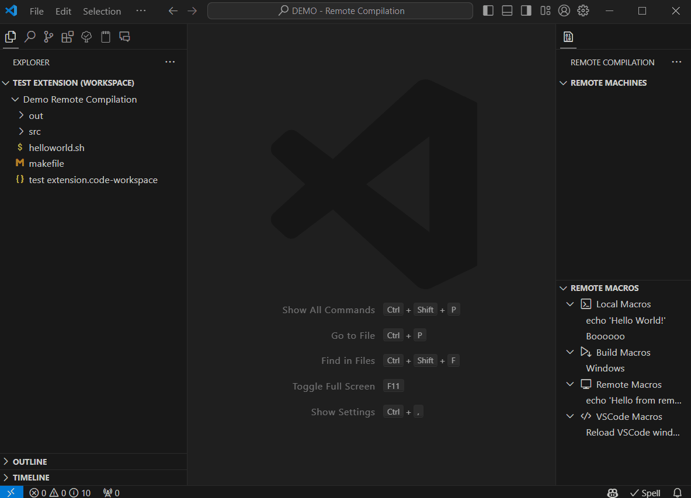
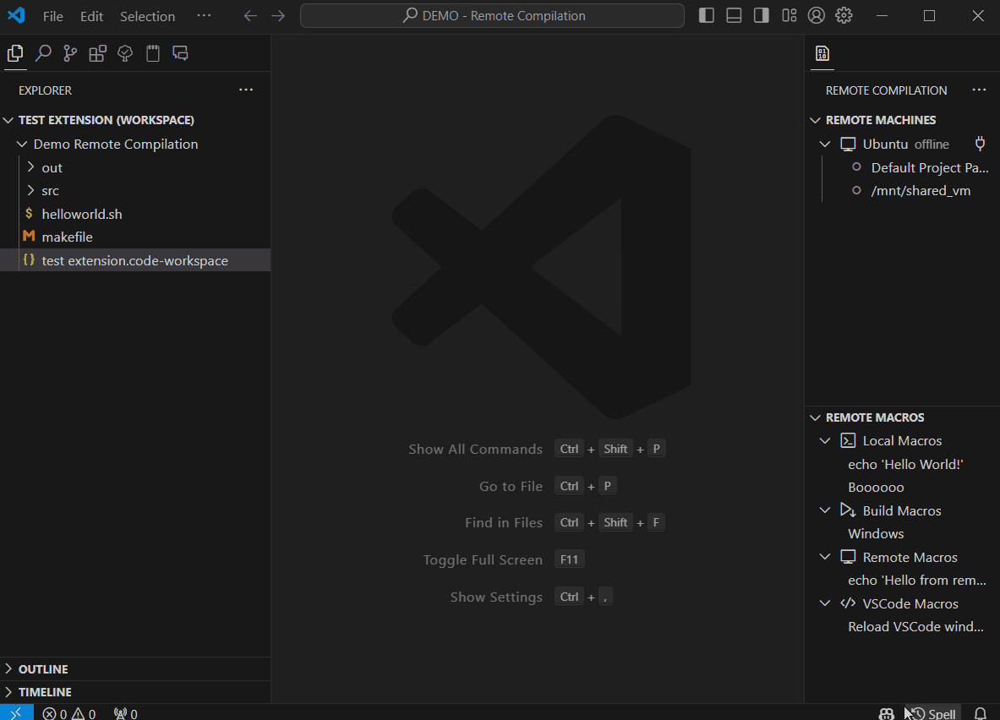
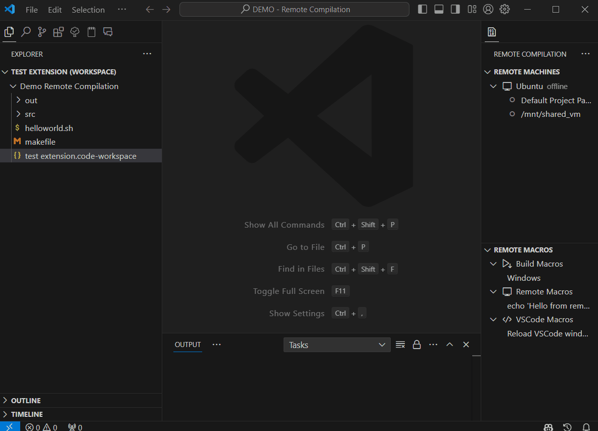
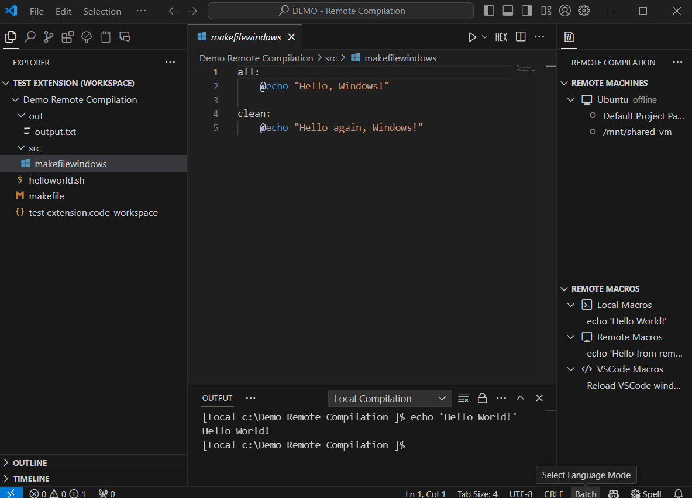

#  Remote Compilation & Macros

Remote Compilation is a VSCode extension I developed during my internship at **IN-CORE Systèmes**. Its objective is to reproduce part of NetBeans' functionalities we were using to compile C/C++ over a virtual machine. The extension aims to easily share compilation configs and macros among collaborators based on a workspace, but keep the machine configs proper to a user.

## Table of Contents
- [Features](#features)
  - [+ Machines](#-machines)
  - [+ Macros](#-macros)
  - [+ Build Macros](#-build-macros)
  - [+ Default Paths](#-default-paths)
- [Extension Settings](#extension-settings)
- [Usage](#usage)
  - [+ About machines](#-about-machines)
  - [+ About Macros](#-about-macros)
- [Upgrade Points](#upgrade-points)
- [Release Notes](#release-notes)
- [More](#more)

## Features

This extension revolves around 4 features:

### + Machines
Machines can be found on the top part of the view. They are defined in the settings by their IP and hostname. They contain paths, which are paths to the project you want to compile on.\
**You can create machines from te view, but for more advanced configuration, you need to edit the JSON.**

### + Macros
Macros can be found on the bottom part of the view, they are defined by their type, name and command. Macros come in 4 categories:
| `group` | Description                                                                     |
|---------|---------------------------------------------------------------------------------|
|`local`  | macros that run terminal commands in a default workspace terminal proper to the extension.|
| `remote`| macros that run terminal commands in a terminal connected via SSH to a machine. A machine needs to be connected **and** focused to run a remote macro on.|
| `vscode`| macros that run VS Code commands.                                               |
| `build` | (see [below](#-build-macros)).                                                   |

**You can create macros from te view, but for more advanced configuration, you need to edit the JSON.**

### + Build Macros
Build macros are macros used to compile code over SSH or in the local terminal. These macros reproduce part of NetBeans' functionalities to compile. They only run the `make` command based on the arguments provided. You can choose a subpath and/or a makefile name that will be used to generate the `make` command with the arguments provided.

### + Default Paths
Default Paths were created so collaborators do not have to set up a new path for every project they open. They are generated using the `remote-compilation.remoteRoot` and `remote-compilation.remoteProjectPath` settings.\
The remote root is supposed to be the absolute path to the shared folder on your VM, for example, `/media/sf_sharedFolder`.\
If the extension finds both settings, it will generate the default path by adding the remote project path to the remote root (e.g., `/media/sf_sharedFolder/project_1`). That way, if your shared folder is not the same as that of your collaborator, your default path should still be correct (if not, you can add a path to the machine).

## Extension Settings
Main settings:
- `remote-compilation.machines`: The machines to run the macros on.
- `remote-compilation.macros`: The macros to run.
- `remote-compilation.remoteRoot`: The root folder (or shared folder) on the VM.
- `remote-compilation.remoteProjectPath`: The path to the project from the VM root.

See **more settings** [here](extension-settings.md#description-of-the-settings).\
See **settings example** [here](extension-settings.md#examples).

## Usage
Find below some gif I hope will help you to use my extension.

### + About machines

>#### Creating a machine
>

>#### Connecting to a Machine
>

### + About Macros

>#### Creating a local/remote macro
>

>#### Creating a build macro
>

<!--
## Known Issues
None (for now)
-->

## Upgrade Points
<!--TODO: having the remote root proper to a machine instead of global to all of them-->
- having the remote root proper to a machine instead of global to all of them
<!--TODO: Add a compilation target ip "WSL" to use wsl to compile the code-->
- Add a compilation target ip "WSL" to use wsl to compile the code
## Release Notes
See Changelog [here](CHANGELOG.md).

## More
Extension page [here](https://marketplace.visualstudio.com/items?itemName=ashtoroth.remote-compilation&ssr=false#overview)

The GitHub Project Page: [remote-compilation](https://github.com/ashtoroth8724/remote-compilation)\
Contributions are welcomed

My GitHub Page: [@ashtoroth8724](https://github.com/ashtoroth8724)

**Enjoy!**
